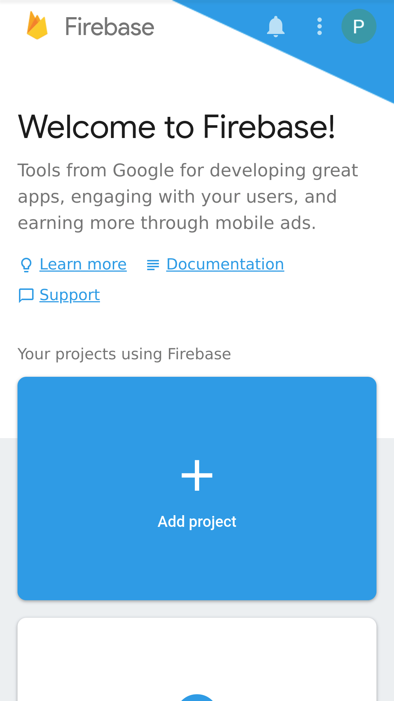
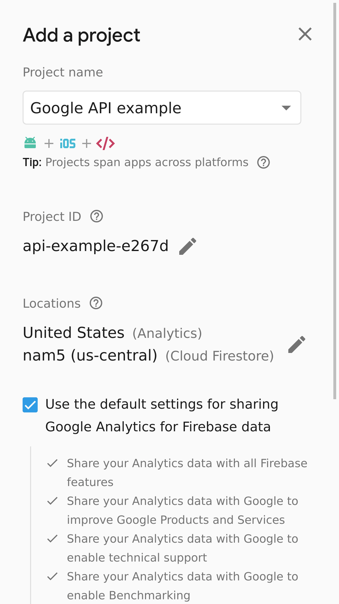
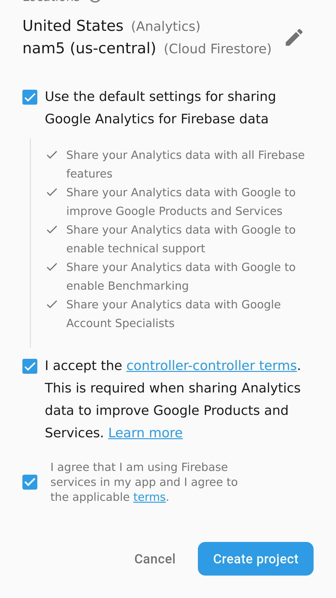
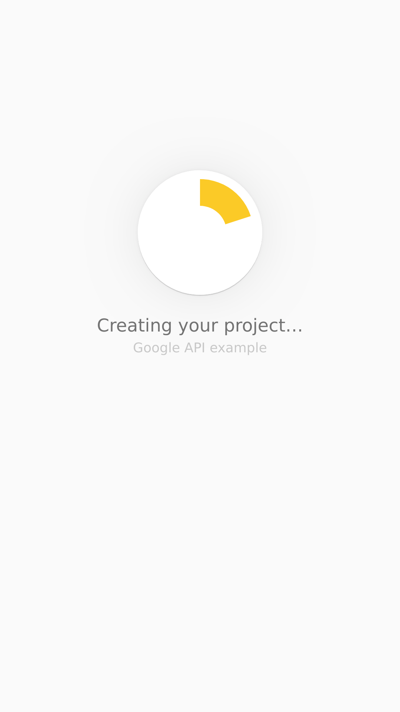
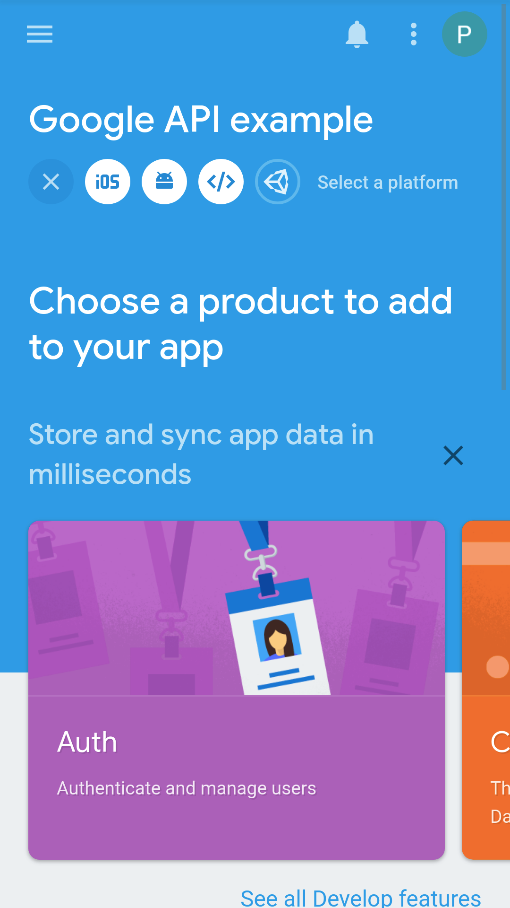
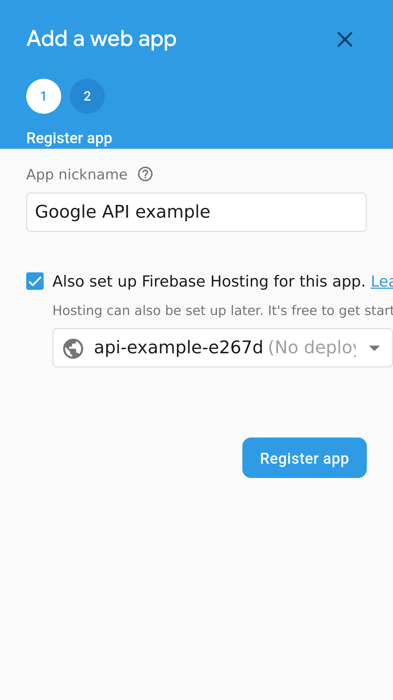
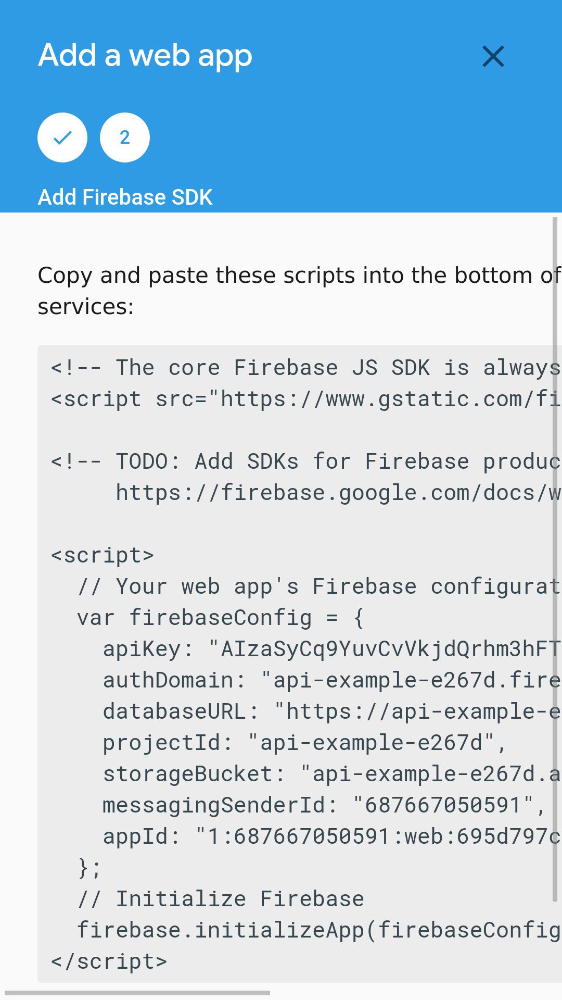

This article is a simple guide on how to implement google api in angular and how to integrate a user session with a firebase service.

# Step 1: Firebase project

1. Go to https://console.firebase.google.com/
2. Create new project
   
|||
| - | - | 
|  |  |
|  |   |
   
3. Add a web app 

||||
| - | - | - |
|  |  |  |

# Step 2: Create Angular project

1. Install angular cli
   `npm install @angular/cli` 
2. Create new angular project
   `ng new firebase-auth-via-google-api-example`
3. Add firebase 
4. Go to https://console.developers.google.com
5. 