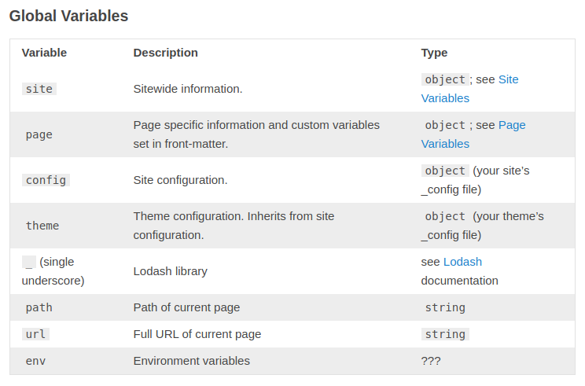

To determine whether we are in production or development mode, we have an available variable in the template called `env`.
Unfortunately, the hexo documentation does not give us details of what may be there.

