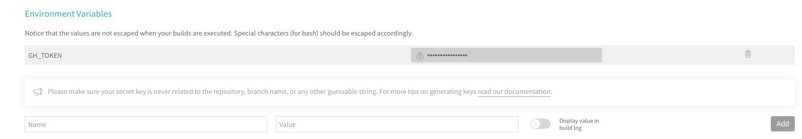

*Run a remotely build project on three systems by tagging the commit.*
<!-- more -->

Continuing work on the [QR Code Generator project](/projects/qr-code-generator) I noticed that I spend a lot of time on the local building of applications on my poor laptop. In addition, I could not build a mac version without a mac (I'm working on ubuntu). *Travis CI* solved my problem, it has a ready osx image for automatic testing and building projects. It was enough to write a configuration script for it and it was ready. Now when committing to the master, travis automatically tests the application, and if you added the commit tag with the new version number, additional steps will be made to deploy the application to the Windows, Mac, and Linux platforms and will be sent as a draft to the github release page.

`/snap/snapcraft.yaml`

```yml
sudo: false

language: node_js
node_js: "9.11.1"

before_install:
  - cd app

cache:
  directories:
    - node_modules
    - app/node_modules
    - $HOME/.cache/electron
    - $HOME/.cache/electron-builder
    - $HOME/.npm/_prebuilds

env:
  global:
    - ELECTRON_CACHE=$HOME/.cache/electron
    - ELECTRON_BUILDER_CACHE=$HOME/.cache/electron-builder

jobs:
  include:
    - stage: Test
      script:
        - npm test
    - stage: Deploy Windows & Mac
      if: tag IS present
      os: osx
      osx_image: xcode10.1
      script:
        - npm run release -- --mac --win
      before_cache:
        - rm -rf $HOME/.cache/electron-builder/wine
    - stage: Deploy linux
      if: tag IS present
      os: linux
      dist: trusty
      script:
        - npm run release
```

Travis has a built-in caching system design, specify the path to the directory that you want to keep after each stage of the job list from the configuration file.
The `npm run release` script is actually `electron-builder -p always`, the command automatically sends build to github release. By adding the `--mac` flag, he builds a project for OSX. The flag `--win` is building a project for Windows. Building for Windows was done on OSX because there is an automated `wine` installation needed to edit `.exe`.


The necessary action that we need to do to send the project to the *github release page* is to add the `GH_TOKEN` variable to the travisa configuration.



When adding a variable, be sure that you have not selected **Display value in build log**, travis build logs are available over the internet, so anyone can steal the key if they know where to look.

Now if you have such a configuration in the travis project, it will perform the tests yourself for you, and by doing `git tag -a v1.0.1 -m 'v1.0.1' && git push origin --tags` travis will start to build an application release and send it to `github release page`.

Link to [qr code generator github repository](https://github.com/studioLaCosaNostra/qr-code-generator-desktop).