Email marketing is one of the cheapest and easiest ways to get your website and online store to returning recipients. This is a form of advertising that goes to the most private place on the web, which is your mailbox. The results of reports from many campaigns around the world show that investment in this form of advertising works and is successful. That is why it is worth starting work on your newsletter!

There are many ready tools for creating email marketing campaigns like Mailchimp, Freshmail or Getresponse. These are real harvesters with an endless array of possibilities, but in this article we will not describe their capabilities. We will only discuss the topic of building your own mini system from scratch to send emails to our subscribers. We will use the **Firebase** development platform and the **Angular** web application framework for this purpose.

## Czym jest Firebase?

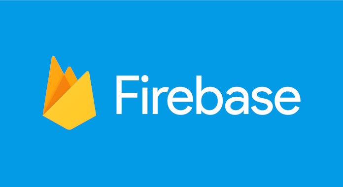

Firebase is a development platform created by Firebase Inc. in 2011, which was later bought by Google in 2014. The platform is mainly focused on creating an ecosystem that facilitates the rapid creation of good quality mobile applications. 
In our application we will use only a few services provided by it:

1. Hosting - 1GB of disk space for our project, 10GB of free monthly transfer + automatically configured SSL certificate. Plus, thanks to firebase-cli we send our ready code in a few seconds.
2. User Authentication - User registration and login system built into the platform from many services like Facebook, Twitter or of course Google. Implementation is very simple and saves a lot of time on application development, not the authentication system.
3. Firestore - A flexible and scalable NoSQL database that I will write about later.
4. Firebase cloud functions - A service that allows creating the backend code of our project. We have full access to handling Https queries, creating triggers for Firebase events or user credentials, and code executed at a specified time interval.

## Firestore and database structure determination

As we have already learned, Firestore is a NoSQL database embedded in the platform, we do not create tables and complicated selectors as is the case in SQL databases. Here we rely on document collections. Thanks to collections, we can sort our documents according to their purpose, and then, using queries about appropriate fields, extract data of interest to them. The document is a record containing fields that are mapped to values. Each document has an identifier, after which we can refer to it.

### What collections will our application need?

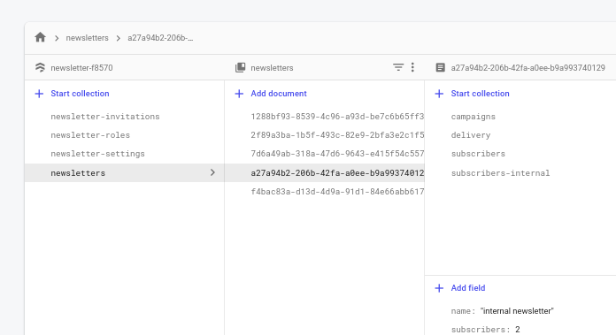

From the very beginning of designing, you should think that not only the owner will want to work on the newsletter. You need to develop a collection that will store information about the role a given system user plays in the newsletter. For simplicity, we only have three roles: owner, administrator and member. Each of them has different access rights to the collection in the system. Firestore allows access to the database already at the frontend level, so you probably wonder how to do it when you can query the database for each document and edit it. Usually the backend is from protecting and communicating with the database. Here Firestore Seciurity Rules comes in handy. By using a simple javascript-like syntax, you can create security policies. Determine who has what access to a given resource based on information in the user's role collection.

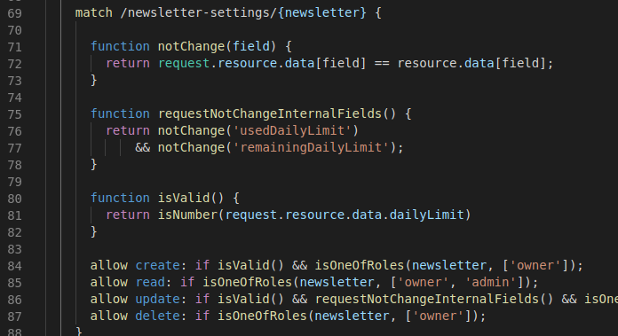

Once we have the role system, we need to determine what data we need to have for the newsletter to perform its task:

* *Newsletter settings* - Authentication for SMTP, description of the first message for subscription confirmation, daily limit of messages (some services like Gmail only allow a certain number of sent messages per day). Only the owner and administrators will have access to this data.

* *Newsletter* - Name in the system, e-mail address from which we send messages, information on errors that occurred (e.g. incorrectly configured SMTP authentication), the number of subscribers, the number of messages sent. In addition to these fields, our document will contain additional document collections (Firestore allows you to nest a collection document with subsequent documents):
  * *Subscribers* - e-mail address, if confirmed subscription, date added and information received by us from the beginning of the list. Only the owner and administrators will have access to our list.
  * *Internal subscribers* - Token of subscription confirmation and cancellation. This data has been specially separated from *Subscribers*, because that's the only way we can give them different security policies. Secure tokens are known only to the system and available only using cloud functions, having full access to all firestore resources.
  * *Messages* - Name in the system, Message title, Message content and ID of the author of this message. The message can be edited by the author, owner and administrators. Anyone who has a specific role in the *newsletter* can read.
  * *Delivery* - *Newsletter* ID, *message* to be sent, shipment status, delivery creation date. Only the owner and administrators can send and read our deliveries.

An additional collection that still needs to be created is *invitations*. After all, not everyone already has an account in our system, you must first invite them by email, and the system must know that the new user was previously invited to the *newsletter* and assign him new roles.

* *Invitations* - e-mail address, *newsletter* ID and assigned role.

We have already fully exhausted the topic of the structure of our database, it's time to move on to creating the backend part.

## Firebase cloud functions - backend

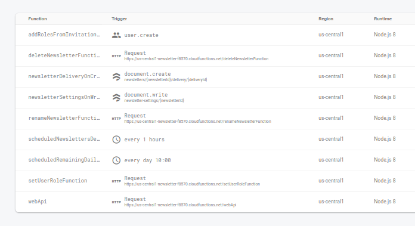

To support subscribers we need to create a REST API. Each newsletter must be able to subscribe to it, send confirmation e-mails and unsubscribe from each e-mail with one click. Cloud functions allow you to create such an interface using the popular express.js library, eventually we will create such endpoints:

* **/api/v1/subscribe** - Responsible for registering new subscribers.
* **/api/v1/confirm** - In the first message immediately after subscribing to the newsletter, the URL from this endpoint is sent to the subscriber so that he can confirm his email address.
* **/api/v1/unsubscribe** - The URL is provided in every message to the subscriber, usually at the bottom, but this can be changed in the newsletter settings.

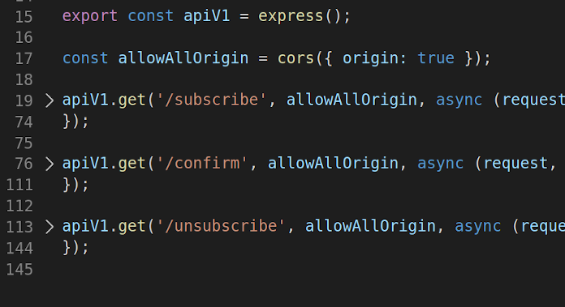

With API this will be everything, thanks to the fact that the firestore enables us to work with the database on the frontend side, we do not have to create further endpoints responsible for individual actions in our system. Only complex database operations are performed on the cloud functions side. We have two cases in our system:

* Deleting the newsletter - In Firestore, deleting the document will not delete its subcollection, so in this case we must get to each subcollection of the document and delete the existing content. This is a very long and complicated operation, so it is recommended to perform it on the backend side. For this purpose, you can use *Http Callable Functions*, which are a variation of http queries, but with user identification.
* Changing the name of the newsletter - To improve the operation of the application, the name of the newsletter is not only found in the newsletter document, but also for each user role, which improves the operation of the frontend page of the project.

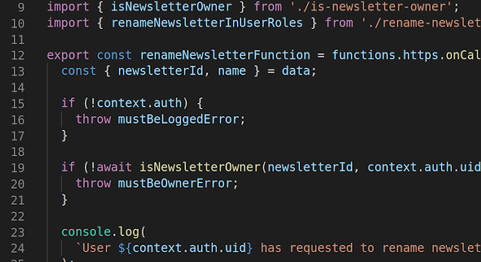

By changing the newsletter settings we have the option of setting a daily limit of sent messages, we must observe its change. Firestore has the function of running the cloud functions code when editing a specific document from the collection, thanks to which we can update the message limit for that particular day.

You probably wonder how messages are sent by our system. Well, it works quite simply. Every hour a backend code (cron jobs) is launched, which searches the newsletter collections with the daily message limit not used and with a flag indicating whether it is waiting for any message to be sent in the * delivery * collection. Each subscriber stores in his document the current status of received messages from the * delivery * collection. Without this it is not possible to create subsequent inquiries to the database about subscribers waiting to send a message. Using the nodemailer library, the system connects to the mailing service and sends messages until the end of subscribers or until the end of the daily message limit.

Similarly, message limits are reset every day at 10 o'clock.

A newly registered user must also use the backend code to find all invitations he has received and add new roles to the system.

We have now described the backend part, now we go to the frontend. :)

## What is Angular?

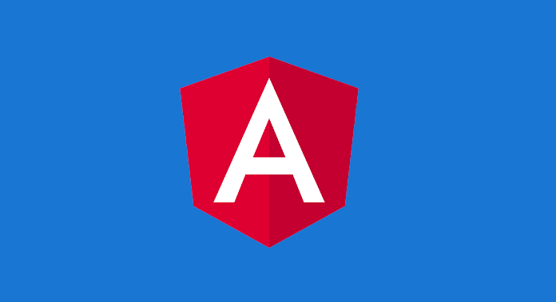

Angular is a framework that streamlines the creation of fast and efficient web applications. Systematically developed by Google, every year it becomes more and more a comprehensive platform for creating SPA next to React or Vue.

### Technologies used

The project in its core uses the Firebase library to communicate with Firestore and NGRX to save the state of recently downloaded data from our database, which alleviates the stage of loading content during active use of the application. Facilitating work on the appearance of the application, the material design library and flex-layout were used. To reduce the cost of downloading the page, the @ angular / pwa library has been added to the project, which introduces our system to the world of service-workers and intelligent caching of applications on the client's side. The prosemirror library was used to edit the message. It has a set of tools ready to create an option-rich text editor. Its main advantage is the ready transaction system that allows us to edit one document by many people at the same time as in Google Docs. One of the problems to be solved was search engine visibility. The frontend part of the system is a typical SPA application, i.e. the entire content of the page is generated only by javascript functions. For many search engines this is a problem because their robots can only analyze the returned HTML content from the server response. The solution to this problem is the library for prerendering HTML content from within the application, i.e. Angular Universal. Using it, we generate predefined application subpages and send them as static html for Firebase hosting.

### Web application pages

||||
| - | - | - |
| 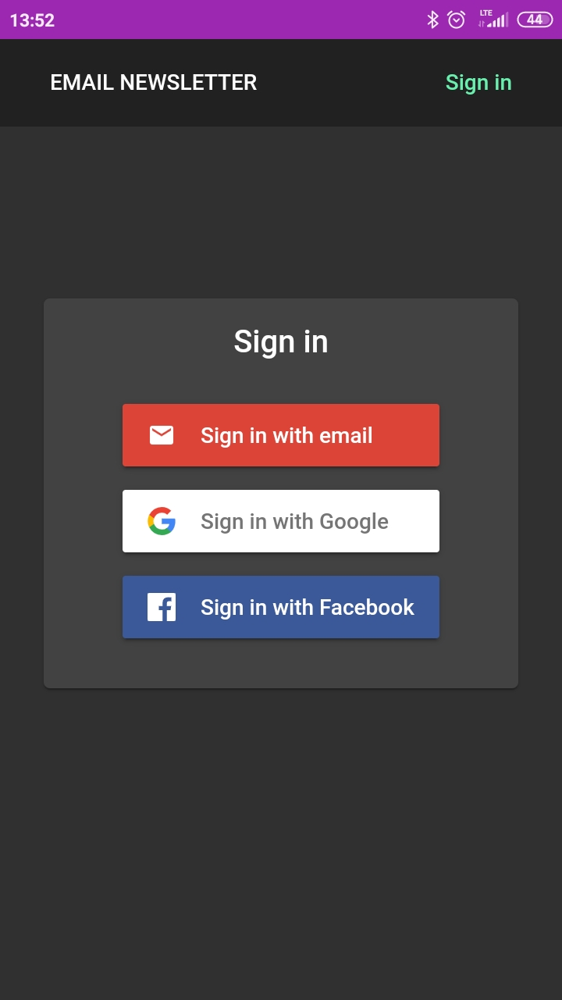 | 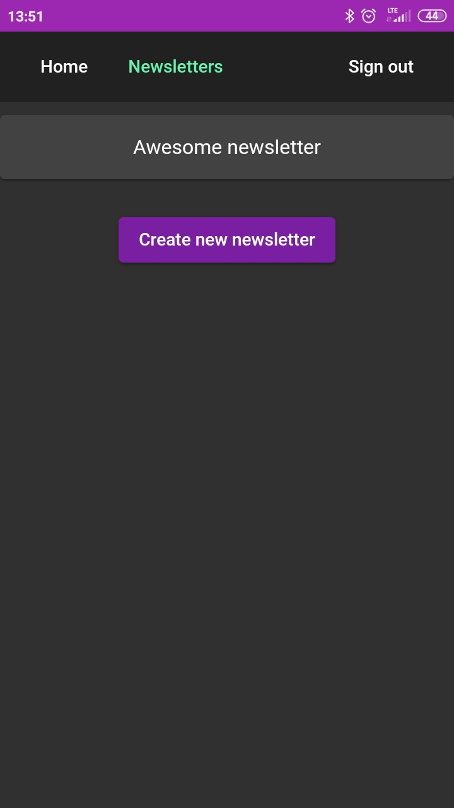 | 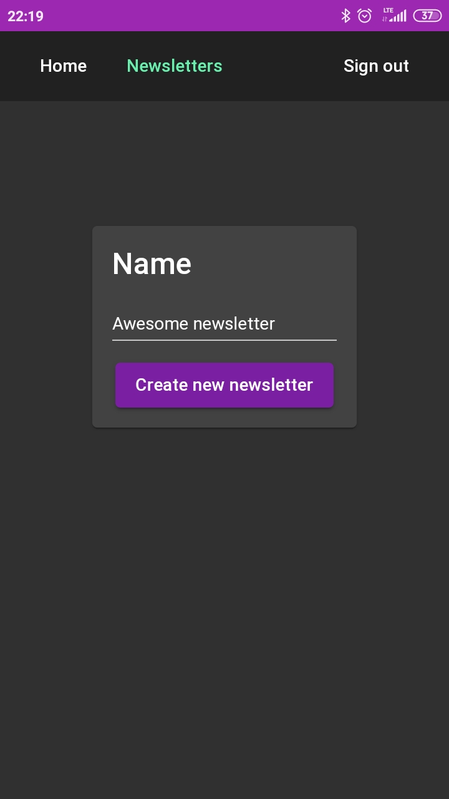 |
| 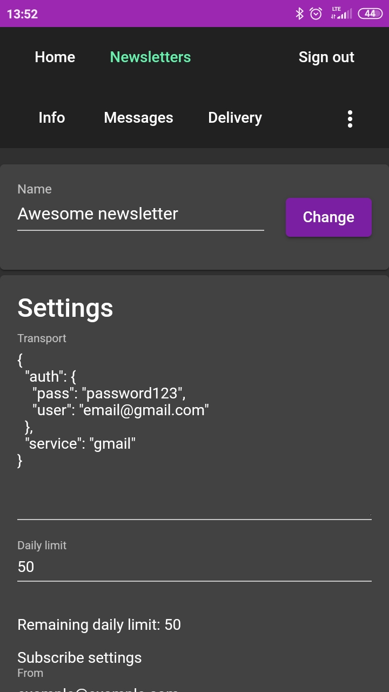 | 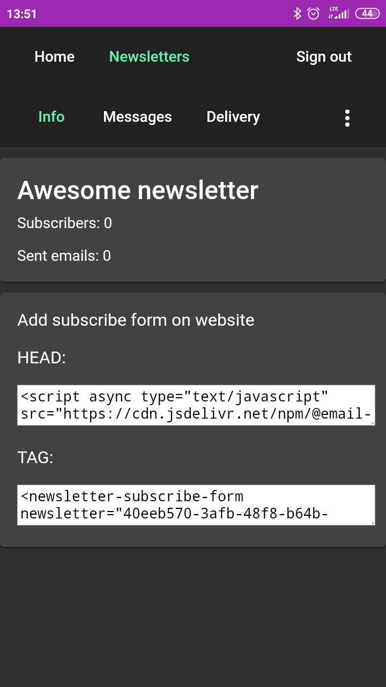 | 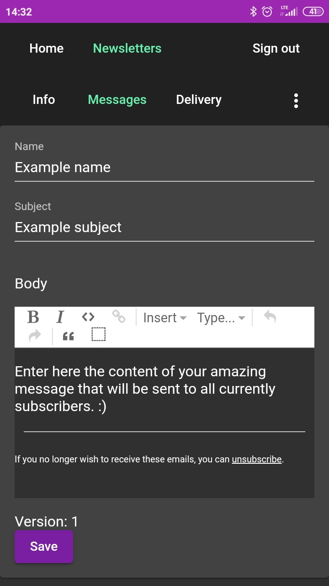 |

The newsletter system needs a few basic views so that the user can freely build his email marketing base:

* *Login and registration* - Like any advanced service, we need to include a page where the user can log in freely or create a new account.
* *Newsletter list* - First view after logging in. List of available newsletters, drawn from the user role collection.
* *New newsletter* - Create a new newsletter, where you enter the name of the new newsletter and after approval you are directed to the rest of the settings.
* *Settings* - Edit SMTP authentication, change the name of the newsletter, edit the confirmation message subscribes, list of users with the ability to edit the role and invite new people. The view is available only to the owner and administrators.
  * *Subscribers* - List of all subscribed newsletter members.
  * *New message* - View of new message. With fields for name, title and content of the message. It is also used to reedit messages in the system.
  * *Messages* - A list of created messages that we can immediately send to our subscribers.
  * *Delivery* - A list of all messages sent or waiting to be sent to users.
* *Newsletter* - Basic statistics, i.e. number of subscribers, number of sent e-mails from the beginning of their existence. HTML code for the custom element created (Subscription Form), which can be immediately inserted into your website or Lead Magnet Landing Page-y. This view is also an entry to other subpages of each newsletter.

### Formularz subskrypcji

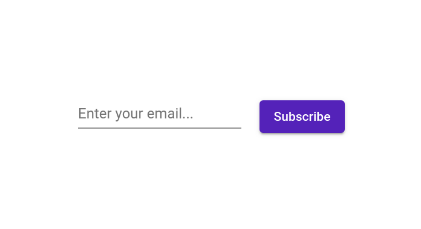

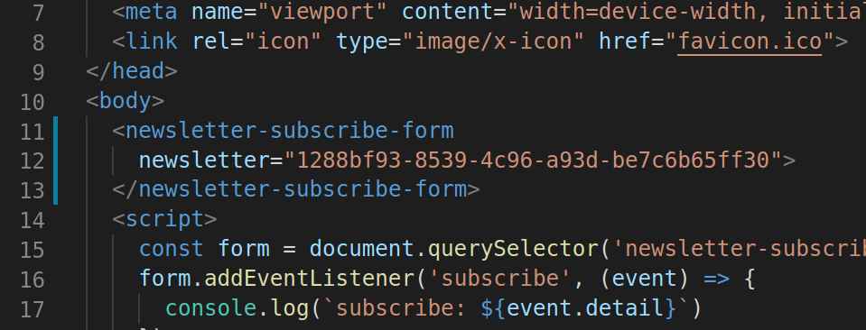

The @angular/elements library has been used to create a subscription form. Angular Elements is a library that contains all the tools you need to transform an Angular Component into a framework-independent custom HTML element (also called Web Component). Thanks to this solution, we can provide the client with an easy start in integrating the newsletter with his website.

## Summary

So far, our newsletter can only send the basic minimum, i.e. the same message to all subscribers. In the near future we will be adding the automation of dispatch, which will facilitate the creation of personalized messages based on the behavior of the subscriber. There is not much more code in the article, but rather it would require a few parts of the course. If after reading the text you are interested in seeing the whole project code, then please visit [githuba](https://github.com/studioLaCosaNostra/email-newsletter) where the whole project is located, and if you want to use e-mail marketing in your business. Then start your adventure today by registering at [https://email-newsletter.web.app/](http://email-newsletter.web.app/).
The project is further developed hobbyically after work, requires adding many more features in order to be able to compete with the offer available on the market. If you would like to contribute to further development, whether it's programming or suggest some functionality, please contact me at [contact](mailto:studiolacosanostra@gmail.com).
