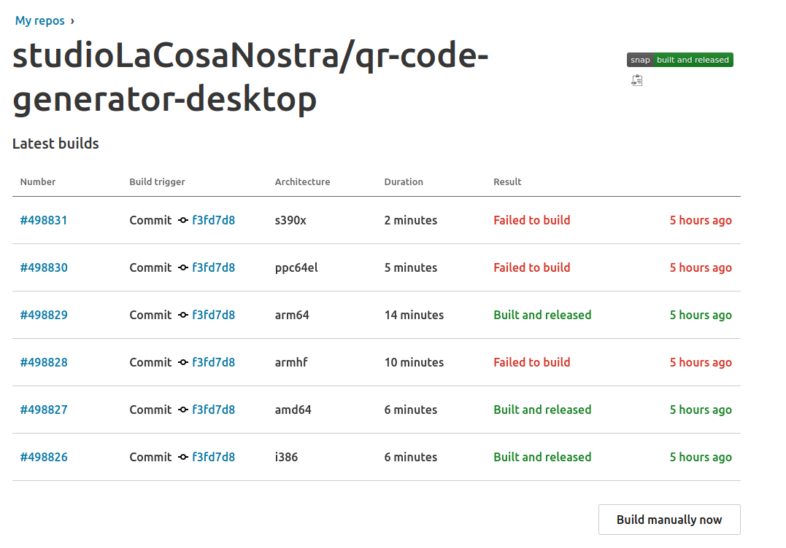

A friend asked me for a simple application to [generate QR Codes][qr-code-generator]. It took me a few moments to design it in the angular. As the website already worked, a friend also wanted it to be an offline application on the desktop. Seconds have not passed since launching it in Electron and playing in refining the window. A friend was very happy with the sent .exe and that would be enough, but I was thought to share the snap. Canonical has created a snapcraft store that includes automatic building of github project on various architectures. Only there is a problem, electron-builder generates `.snap` but not `snapcraft.yaml`. I thought it would be easy and I will find an example on the internet. Well, there were a few, but they did not work properly on all systems (I tested on ubuntu 18.04 and 18.10 and there were problems with gtk). That's why I spent almost two days looking for a well-made `snapcraft.yaml` for the electron application. In the end, I found a nice project https://github.com/snapcrafters which contained examples of applications made in electron as *Atom*, *VSCode*, *Gitter*. Below I present the code which I managed to create based on other snaps for [QR Code Generator][qr-code-generator].

```yaml
name: qr-code-generator-desktop
passthrough:
  title: Qr Code Generator
version: 1.0.2
summary: You can save them as PNG image. You can change the size of the image.
description: |
  An application created for a friend. Based on the electron platform. The generator offers:
  * Preview how the QR code changes when entering text
  * Write to the PNG file generated QR code
  * Changing the image size before saving

grade: stable
confinement: strict

plugs:
  gnome-3-26-1604:
    interface: content
    target: $SNAP/gnome-platform
    default-provider: gnome-3-26-1604
  gtk-3-themes:
    interface: content
    target: $SNAP/data-dir/themes
    default-provider: gtk-common-themes
  icon-themes:
    interface: content
    target: $SNAP/data-dir/icons
    default-provider: gtk-common-themes
  sound-themes:
    interface: content
    target: $SNAP/data-dir/sounds
    default-provider: gtk-common-themes

parts:
  gnome:
    plugin: nil
    build-packages:
      - software-properties-common
    override-pull: |
      add-apt-repository -y ppa:ubuntu-desktop/gnome-3-26
      apt -y update

  electron-app:
    after:
      - gnome
      - desktop-gnome-platform
    plugin: nodejs
    source: app/
    node-engine: 9.11.1
    stage-packages:
      - libasound2
      - libgconf2-4
      - libnotify4
      - libnspr4
      - libnss3
      - libpcre3
      - libpulse0
      - libxss1
      - libxtst6
      - libappindicator1
      - libsecret-1-0
      - libgtk-3-0
      - libdb5.3
    build: npm run pack
    install: |
      mkdir $SNAPCRAFT_PART_INSTALL/app
      cd release-builds/*/
      mv * $SNAPCRAFT_PART_INSTALL/app
    stage:
      - -lib/node_modules/*
      - -usr/share/doc/*
      - -usr/share/man/*
      - -share/man/*
      - -share/doc/*
      - -CHANGELOG.md
      - -README.md

apps:
  qr-code-generator-desktop:
    command: bin/desktop-launch $SNAP/app/qr-code-generator-desktop
    plugs:
      - home
      - desktop
      - desktop-legacy
      - x11
      - unity7
      - wayland
      - browser-support
      - network
      - gsettings
      - pulseaudio
      - opengl

    environment:
      TMPDIR: $XDG_RUNTIME_DIR
      DISABLE_WAYLAND: 1
```

The entire Electron build available on [github][qr-code-generator-github].
You can see the directory structure, and also how to add a desktop icon `snap`.



I hope that someone will use this post someday.
It is a pity that the `nodejs` plugin and `electron-builder` does not supports all architectures available in snapcraft, maybe one day it will change.
Good luck snapcrafters.

[qr-code-generator]: /projects/qr-code-generator
[qr-code-generator-github]: https://github.com/studioLaCosaNostra/qr-code-generator-desktop