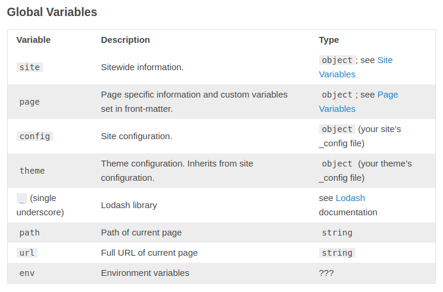
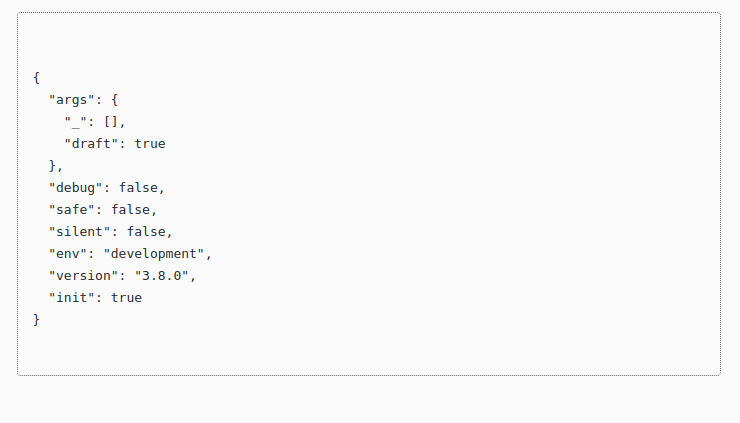
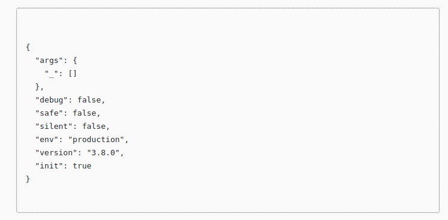

To determine whether we are in production or development mode, we have an available variable in the template called `env`.
Unfortunately, the hexo documentation does not give us details of what may be there.



However, to see what is sitting there, you only need to print the contents of this variable in the template
Example `themes/<some-theme>/layout/layout.ejs`

```html
<!DOCTYPE html>
<pre>
  <code>
<%= JSON.stringify(env, null, 2) %>
  </code>
</pre>
```

Then opening [localhost:4000](http://localhost:4000) you will see this result.



As we can see, hexo `env` contains an `env` property which represents the application mode in which it started.
In `hexo server` will be development, and when generating a static page to change the value of `env.env` just add `NODE_ENV=production` before `hexo generate`
`NODE_ENV=production hexo generate`



Now we can use the acquired variable, for example, to add analytics only in production mode.

```html
<% if (env.env === 'production') { %>
  <!-- Global site tag (gtag.js) - Google Analytics -->
  <script async src="https://www.googletagmanager.com/gtag/js?id=GA_TRACKING_ID"></script>
  <script>
    window.dataLayer = window.dataLayer || [];
    function gtag() { dataLayer.push(arguments); }
    gtag('js', new Date());

    gtag('config', 'GA_TRACKING_ID');
  </script>
<% } %>
```

That's all, goodbye.