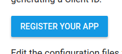

Unfortunately, Adsense requires you to log in to the real user of your Adsense account. For this purpose, we will use the key generated from the [Google Adsense Management API site](https://developers.google.com/adsense/management/getting_started) and **click**


Program code in typescript: `adsense.ts`

```typescript
import { adsense_v1_4 } from 'googleapis';
import { readFile } from 'fs';
import { promisify } from 'util';
import { OAuth2Client } from 'google-auth-library';
import * as http from 'http';
import * as url from 'url';
import opn = require('opn');
import moment = require('moment');

const readFileAsync = promisify(readFile);
/**
 * Start by acquiring a pre-authenticated oAuth2 client.
 */
let oAuth2Client: OAuth2Client;
async function getAdsense() {
  if (!oAuth2Client) {
    oAuth2Client = await getAuthenticatedClient();
  }
  // After acquiring an access_token, you may want to check on the audience, expiration,
  // or original scopes requested.  You can do that with the `getTokenInfo` method.
  const adsense = new adsense_v1_4.Adsense({
    auth: oAuth2Client
  })
  const otherMonths = (await adsense.payments.list()).data;
  const otherMonthsSum = otherMonths && otherMonths.items && otherMonths.items.reduce((sum, item) => sum + Number(item.paymentAmount), 0) || 0;
  const date = new Date();
  const thisMonth = (await adsense.reports.generate({
    startDate: moment(new Date(date.getFullYear(), date.getMonth(), 1)).format('YYYY-MM-DD'),
    endDate: moment().format('YYYY-MM-DD'),
    metric: ['AD_REQUESTS', 'CLICKS', 'EARNINGS']
  })).data.totals;
  const thisMonthSum = thisMonth && Number(thisMonth[2]) || 0
  const sum = Number((thisMonthSum + otherMonthsSum).toFixed(2));
  return {
    thisMonthSum,
    otherMonthsSum,
    sum
  }
}

export const initAdsense = getAdsense;

/**
 * Create a new OAuth2Client, and go through the OAuth2 content
 * workflow.  Return the full client to the callback.
 */
function getAuthenticatedClient() {
  return new Promise<OAuth2Client>(async (resolve, reject) => {
    // create an oAuth client to authorize the API call.  Secrets are kept in a `keys.json` file,
    // which should be downloaded from the Google Developers Console.
    const credentialsBuffer = await readFileAsync('./configs/credentials.json');
    const credentials = JSON.parse(credentialsBuffer.toString())
    const oAuth2Client = new OAuth2Client(
      credentials.web.client_id,
      credentials.web.client_secret,
      credentials.web.redirect_uris[0]
    );
    // Generate the url that will be used for the consent dialog.
    const authorizeUrl = oAuth2Client.generateAuthUrl({
      access_type: 'offline',
      prompt: 'consent',
      scope: 'https://www.googleapis.com/auth/adsense.readonly'
    });
    // Open an http server to accept the oauth callback. In this simple example, the
    // only request to our webserver is to /oauth2callback?code=<code>
    const server = http
      .createServer(async (request, response) => {
        try {
          if (request.url && request.url.indexOf('/oauth2callback') > -1) {
            // acquire the code from the querystring, and close the web server.
            const urlSearchParams: url.URLSearchParams = new url.URL(request.url, 'http://localhost:3000')
              .searchParams;
            const code = urlSearchParams.get('code');
            response.writeHead(200, { "Content-Type": "text/html" });  
            response.end(`
            <html>
              <body>
                Authentication successful! Please return to the console.
              </body>
            </html>
            `);
            server.close();

            // Now that we have the code, use that to acquire tokens.
            if (code) {
              const { tokens } = await oAuth2Client.getToken(code);
              oAuth2Client.setCredentials(tokens);
              console.info('Tokens acquired.');
              resolve(oAuth2Client);
            } else {
              console.log('missing code');
            }
          }
        } catch (error) {
          reject(error);
        }
      })
      .listen(3000, () => {
        // open the browser to the authorize url to start the workflow
        console.log('server created');
        opn(authorizeUrl, { wait: false }).then(childProcess => childProcess.unref());
      });
  });
}

initAdsense();
```

to run code

```bash
ts-node adsense.ts
```

the program will open the google page for you to authorize the adsense account.
After authorization, the program already stores an authentication token, so every next call to the `getAdsense` function will not open the browser window any more.
