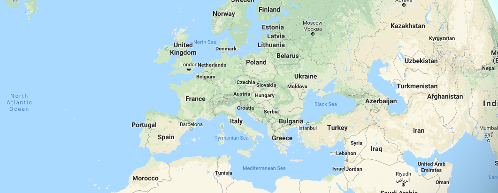
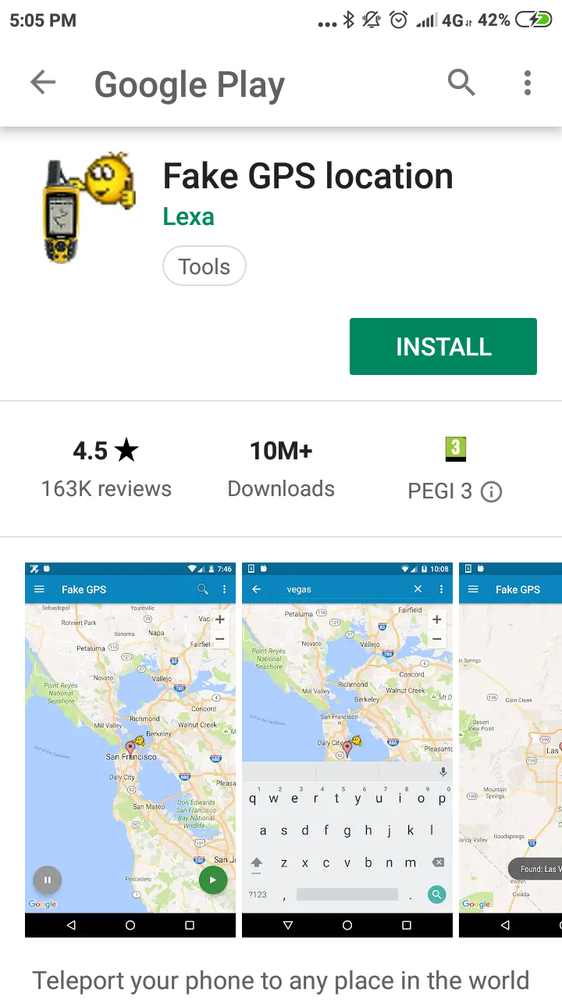
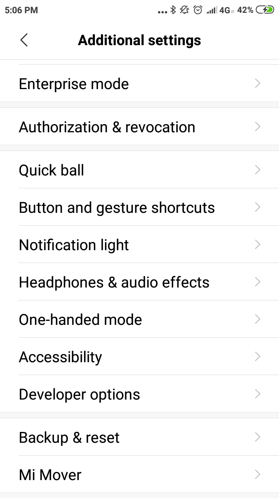
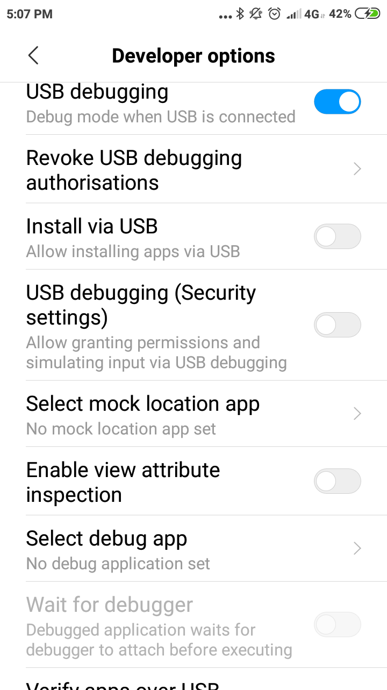
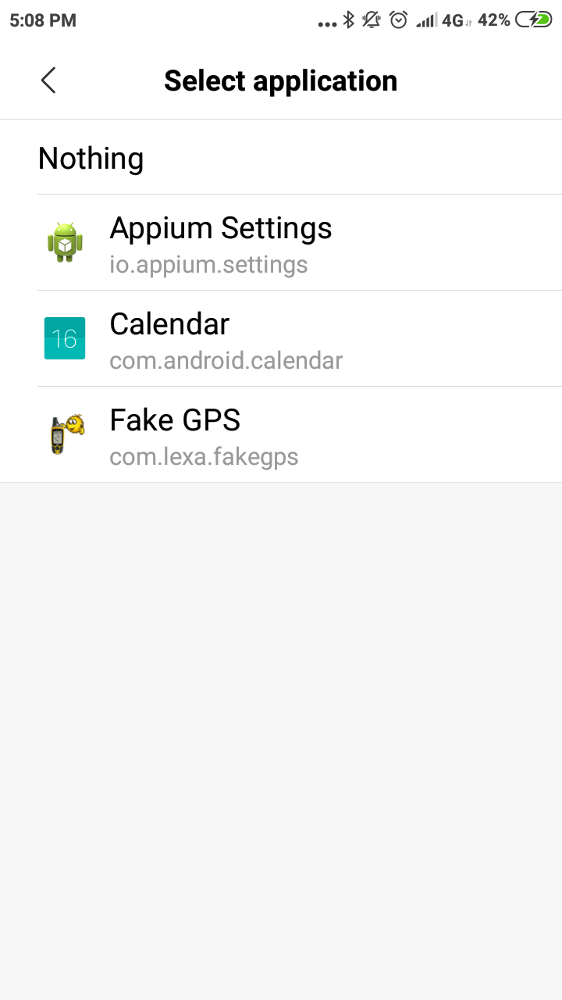

To be able to do this, you must activate the developer mode in the android system.

Steps to activate developer mode can be found in [google](https://www.google.com/search?q=how+to+enable+android+developer+mode)

Steps to activate mock location:



1. Install the [Fake GPS location](https://play.google.com/store/apps/details?id=com.lexa.fakegps) application.
   

2. Go to **Developer options**
   

3. **Select mock location app** and select application *Fake GPS location*
   
   
