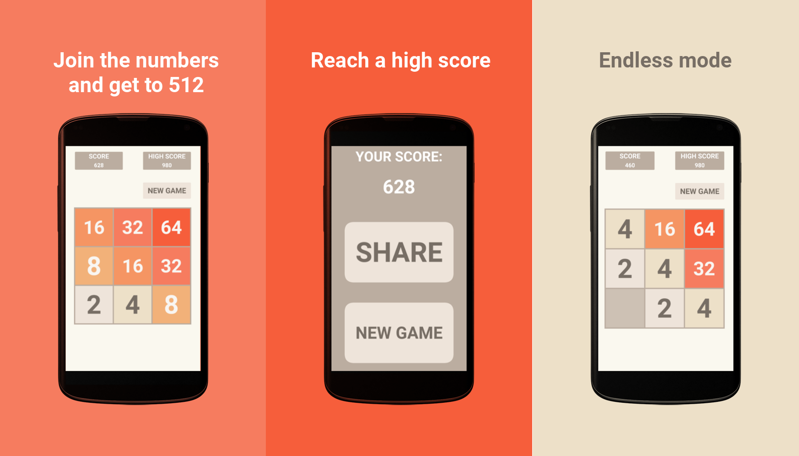

# 512 - Number puzzle game
[][Google play link]

*Combine squares to get the highest number possible.*

512 is a version of the amazing puzzle game 2048 made especially for Android. Move the squares from one side to another adding the numbers up to get the highest number possible. Unlike the original, in this version, the game is still on when you reach 512. Keep playing and adding numbers until you run out of space on the board.



Each time you move a square, a new one, with the number 2 (or a multiple of 2), will appear. When you combine two squares with the same numbers, they’ll become a new square which contains the sum of these two. For example, if you add two squares with the number 32, you'll get a single square with 64.

With this in mind, combine the squares to get the highest number possible. When there's no more space on board, the game ends, but getting to this point is a challenge most people never completed.

512 is a great version of the famous puzzle game 2048 to play on Android, with a gameplay perfectly adapted to touch screens.

[][Google play link]

**Download from google play qrcode!**

- [Privacy Policy for Android & IOS][Privacy Policy]

[Google play link]: https://play.google.com/store/apps/details?id=com.laCosaNostra.FiveHundredAndTwelve2&referrer=utm_source%3Dblog
[Privacy Policy]: privacy_policy.html