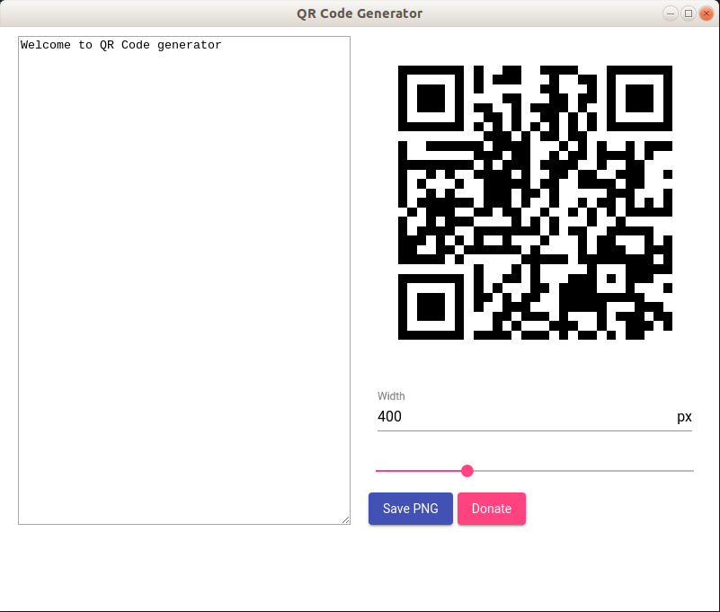

*Create custom QR Codes. You can save them as PNG image. You can change the size of the image.*

An application created for a friend. Based on the electron platform. The generator offers:

* Preview how the QR code changes when entering text
* Write to the PNG file generated QR code
* Changing the image size before saving

Web: [QR Code Generator][Web version]

Linux, Window, Mac releases: [Qr Code Generator github releases][Github releases]

Available on snapcraft:

<iframe src="https://snapcraft.io/qr-code-generator-desktop/embedded?button=black&summary=true&screenshot=true"
  frameborder="0" width="100%" height="700px" style="border: 1px solid #CCC; border-radius: 2px;"></iframe>

[Web version]: /apps/qr-code-generator/
[Github releases]: https://github.com/studioLaCosaNostra/qr-code-generator-desktop/releases